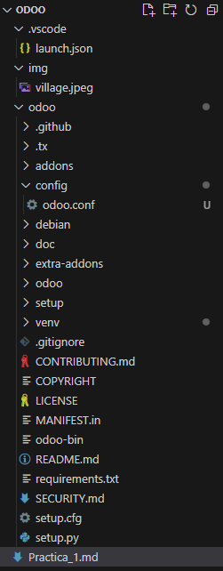
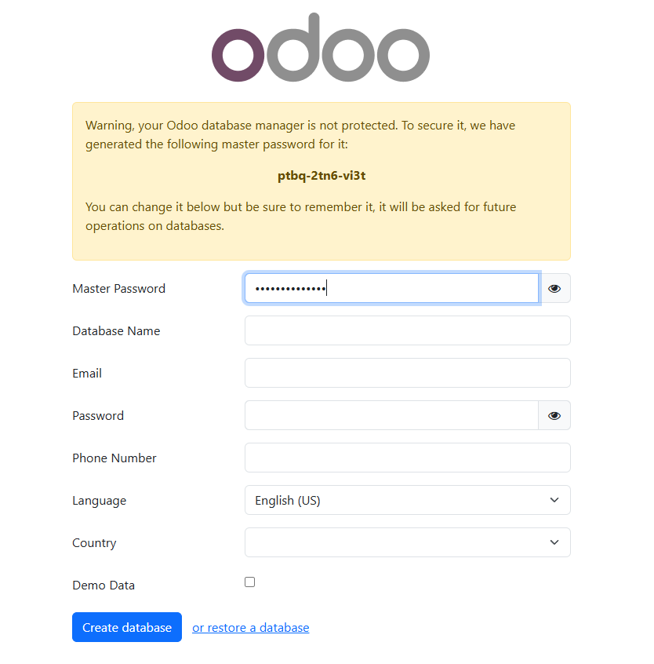

*Warnings*
---

Para la realización de esta práctica voy a tener los siguientes supuestos:
+ Conocemos los comandos de git básicos.
+ Sabemos leer, interpretar y comprender documentación.
+ Podemos leer oraciones **largas** y comprender aquello que se nos solicita.
+ Nos tomamos en serio lo que estamos haciendo, si no trabajais, yo tampoco lo haré *(y tendreis un 0 en consecuencia)*.
+ Todos los apartados se evaluan de forma *aislada* en la medida de lo posible.
+ Soy consciente que propongo retos que no deberiais de saber *a priori*, por ello estoy disponible en clase para lo que necesiteis.
+ Estos documentos buscan ayudar a completar las distintas tareas, a estudiar, a comprender y profundizar en los contenidos vistos en clase, bajo ningún concepto están pensados para ser un copia y pega de las tareas propuestas o que puedan sustituir a la realización de las prácticas en clase.
+ Si alguien decide *copiar* o hacer *brujería* lo sabré. 

*Waymarks*
---

Para la realización de la práctica es necesario realizar los siguientes puntos previos:
+ Completar la instalación de Git en el equipo. [Descarga de Git](https://git-scm.com/downloads/win)
+ Tener una versión de Python instalada. *(Recomendable la versión 3.13, aunque se va a realizar el ejercicio con la versión 3.11.9)* [Descarga de Python](https://www.python.org/downloads/)
+ Completar la instalación de PostgreSQL. *(Recomendable la version 17.1)* [Descarga de PostgreSQL](https://www.enterprisedb.com/downloads/postgres-postgresql-downloads)
+ Leer Style Guide for Python Code *(PEP 8)* pues haremos referencia a ello en la nomenglatura de variables. [Enlace a PEP 8](https://peps.python.org/pep-0008/)

Como IDE es recomendable el uso de PyCharm, aunque personalmente prefiero usar VSCode por comodidad. Lo dejo a preferencia personal.

# Recomendación musical.
[Black Mage Village OST](https://www.youtube.com/watch?v=s3f725IZC0w)

La Tienda de nº 163
====================

*Se escucha en la lejania un sonido... ¡¡los humanos están aqui!!*


Nº 163 acaba de abrir su tienda y no sabe que tiene que hacer para mantenerla a flote. 

Tiene varios objetos para vender, hasta ha pensado que puede dar cuando alguien le pida *"lo de siempre"*, pero ahí acaba todo su conocimiento.
Tiene problemas de memoria y le gusta perderse entre sus libros para distraerse por lo que no tiene una gestión de inventario adecuada ni un trato correcto a los clientes. 

Por suerte acaba de leer un libro relacionado con sistemas de gestion empresarial y se aventura a la implantación del sistema antes de que venga su primer cliente.

# Git

En la carpeta del proyecto utilizar el siguiente comando: 

- `git clone https://github.com/odoo/odoo.git`

Con este comando clonaremos odoo del repositorio, estaremos clonando la **versión 18**. Tarda un rato, asi que mientras vamos a realizar una serie de preparaciones.

# Preparaciones

## Python 

Realizar los siguientes comandos para comprobar la version de python y pip:

- `python --version`
- `pip --version`

Comprueba que son versiones válidas, para Odoo 17 es necesario al menos **Python 10**

## PostgreSQL

Añade la carpeta `bin` al PATH de Windows.
- Para ello pulsa `Win + S` y escribe `Editar las variables de entorno del sistema`.
- En el apartado Path agrega la direccion de la carpeta `bin`, generalmente es *`C:\\Program_Files\Postgres\version\bin`*

Abre PGAdmin:
- Crea un usuario, dale permisos de Login y Superusuario. *(Con que pueda crear tablas y hacer login es suficiente).*
- Crea una base de datos nueva, *Odoo no permite usar la BBDD con nombre **postgres** que viene por defecto.* Este paso es unicamente relevante si pretendemos usar una BBDD especifica, pero para ello necesitaremos db_filter en el fichero de configuración, asi que recomiendo que nos saltemos este paso por hoy.

En nuestro caso hemos creado el usuario n163 y la BBDD la llamaremos Magic Shop *(más tarde)*


# Dependencias

Una vez hayamos terminado de clonar el repositorio deberemos de instalar todas las dependencias. Para ello vamos a utilizar un Entorno Virtual y asi garantizar que el sistema funcione en todas las máquinas independientemente de las versiones de los módulos. Más información sobre [entornos virtuales en Python](https://docs.python.org/es/3/tutorial/venv.html)

Para crearlo seguimos la documentacion, recordando que deberá estar contenido en la carpeta Odoo que acabamos de clonar.

Es posible que nos de un error diciendo que no tenemos permisos para la ejecución de scripts al intentar activar el entorno virtual. Para solucionarlo utilizaremos el siguiente comando: `Set-ExecutionPolicy RemoteSigned -Scope CurrentUser`

Despues utilizamos los comandos habituales, ya vistos en clase:
1. `pip install setuptools wheel`
2. `pip install -r .\requierements.txt`

Y una vez terminen podemos comenzar con la configuración del entorno.

# Configuración del "IDE"

Hay un millon y medio de tutoriales para hacer la configuración de PyCharm, y seguro que veis que es infinitamente más fácil de configurar, pero que se le va a hacer, me gustan los retos.

Es recomendable instalar una serie de addons/módulos para la realización de esta práctica:
- Python
- JavaScript (ES6) code snippets
- XML
- Odoo Code Snippets
- Netbeans Keymaps *(os he visto con este IDE demasiadas veces, os será útil para no perder la memoria muscular)*

Crearemos 2 carpetas nuevas:
- extra-addons
- config

Dentro del directorio config crearemos un fichero odoo.conf que estará vacio *(por poco tiempo)*

Lo primero que tendremos que hacer es automatizar el arranque del sistema:
1. Nos iremos a la pestaña del *"Run and Debug"*. 
2. Clicamos en `create a lauch.json file`. Con este fichero podremos arrancar el sistema.
3. Seleccionamos Python Debugger y Python File en el desplegable.
4. Se nos abrirá el launch.json creado. Fijaros que se crea en la ruta raiz del proyecto.

*Waymark*

El proyecto deberá de tener una forma similar a la siguiente.



## Fichero de configuración

Abrimos el fichero de configuración y en su interior vamos a copiar los contenidos del fichero de configuración que se encuentra en la ruta `/odoo/debian/odoo.conf`

Si notais una llama quemandoos por dentro por duplicar código, bien, eso es que estaís progresando adecuadamente, *(si no la habéis tenido, no os preocupéis, algún día llegará, creo en vosotros)*.

Ahora tenéis dos alternativas.
1. Creais un enlace simbolico que junte la carpeta de configuración con la de Debian.
2. Estableceis la ruta del fichero de configuración a la del .conf que se encuentra dentro de Debian.

Ahora bien, 
1. No prentendo hacer un enlace simbólico, no estamos en Linux y paso.
2. Esta alternativa es bastante buena, pero considero que se pierde claridad en el proyecto para vosotros, pero adelante, sois libres.
3. Podeis borrar el fichero, no lo vamos a usar.

Una vez hemos apagado la llama vamos a establecer los contenidos de odoo.conf

```ini
[options]
; This is the password that allows database operations:
; admin_passwd = admin
db_host = localhost
db_port = 5432
db_user = n163
db_password = CONTRASEÑA_DE_USER
addons_path = ./odoo/addons,
                ./odoo/extra-addons
default_productivity_apps = True
```

Vamos poco a poco:

- **db_host** = Es el host de nuestra base de datos, aquí solo está nº 163, aunque está planteando comunicarse con la Tienda de Armas de nº 239 si todo sale bien.
- **db_port** = Es el puerto establecido en la instalacion de PostgreSQL. Generalmente 5432.
- **db_user** = Es el nombre del usuario de la base de datos.
- **db_password** = Es la contraseña del usuario de la base de datos.
- **addons_path** = Es la dirección a las carpetas de addons, se establece la ruta relativa desde el directorio raiz.


## Fichero launch.json 

Para configurar el fichero launch, como os mencioné previsamente, lo podemos encontrar en la carpeta raiz, que en mi caso es ligeramente distinta a la vuestra, asi que en consecuencia mi json es ligeramente distinto.

```json
{
    // Use IntelliSense to learn about possible attributes.
    // Hover to view descriptions of existing attributes.
    // For more information, visit: https://go.microsoft.com/fwlink/?linkid=830387
    "version": "0.2.0",
    "configurations": [
        {
            "name": "Odoo",
            "type": "debugpy",
            "request": "launch",
            "program": "${workspaceFolder}/odoo/odoo-bin",
            "console": "integratedTerminal",
            "args": [
                "--config=${workspaceFolder}/odoo/config/odoo.conf",
                //"--update=all",
                //"--database=Magic Shop",
            ]
        },
    ]
}
```
Igual que antes, vamos poco a poco:

- **name** = Indica el nombre de la configuración
- **type** = Que aplicación estamos usando para el request (En nuestro caso Python debugger).
- **request** = Que acción queremos hacer.
- **program** = Que programa queremos ejecutar, deberemos establecer la ruta del mismo. Para ello usaremos la variable ${workspaceFolder} que establece el directorio raíz.
- **args** = Estableceremos aqui la ruta al fichero de configuracion que hemos creado con tanto cariño previamente. Luego podeis ver dos lineas comentadas, serán relevantes en un futuro puesto que lo que hacen es indicar qué módulos queremos actualizar y dónde están dichos módulos. Si queréis, podeis descomentar las líneas, pero os aviso, tened paciencia cuando arranqueis el sistema.


# Primer Arranque

Por fin ha llegado el momento, podemos iniciar el sistema, asi que clicaremos el triangulito verde en el apartado **Run and Debug**.


Por supuesto, aunque lo hayamos hecho bien pueden ocurrir varios problemas:

1. Hay una posibilidad de que hayamos establecido mal las rutas de los ficheros de addons. En cuyo caso vamos a recibir un *404*.
2. Es posible que se conecte a otra base de datos.
3. Es posible que nos falte alguna dependencia.

## Problemas con dependencias

Revisa los pasos en referencia al Entorno Virtual y repite los pasos para la instalacion de dependencias. Muy seguramente se solucione.

## Problemas con la base de datos

Hay que realizar una serie de cambios al fichero de configuración todavia, pero con añadir el parametro **db_filter** deberia de ser suficiente. 

Otros problemas serian no haber establecido correctamente el usuario y la contraseña para acceder.

## Problemas con los addons

Revisa las rutas de los directorios en el fichero de configuración y en el json de arranque.

## Arranque
Tras conseguir arrancar correctamente el sistema, si entramos a la direccion `localhost:8069` nos deberia aparecer la siguiente pantalla.



Ahora quedaria únicamente establecer todos los datos para iniciar sesión, así como la base de datos.

Indicamos el nombre de la base de datos, el email y la contraseña. En nuestro caso NO vamos a introducir datos de prueba, asi que tras establecer los datos haremos click en **Create Database** y esperaremos a poder entrar en el sistema.

Tras esto podemos ver como en nuestro fichero de configuracion se ha creado un nuevo parametro llamado **admin_passwd** que contiene la master password cifrada.

# Otros parametros del fichero de configuración.

Para hoy lo más relevante es conocer una serie de parametros de configuración nuevos.

- **db_filter** = Ya lo hemos mencionado previamente, pero con este parametro seremos capaces de filtrar las bases de datos que puede usar nuestra plataforma.
Es un parámetro muy importante a la hora de establecer la seguridad de la plataforma por lo que hay que definirlo correctamente. 

- **http_port** = Nos permite modificar el puerto desde el que podemos acceder al sistema. 

- **limit_time_real** y **limit_time_cpu** = Nos permite definir un tiempo maximo para las request que le hagamos al sistema.

# Modo de Desarrollo

Con todo esto ya estaria configurado el sistema, lo único que quedaría sería activar los módulos que consideremos convenientes. 

Pero esto no es suficiente para nº 163, necesita un módulo personalizado. 

# Actividades

## Actividad 1

Activa el modo de desarrollador en el sistema configurado.

## Actividad 2

Revisa los módulos en el proyecto, analiza su estructura e indica que ficheros tienen en común.

## Actividad 3

Estudia la diferencia entre un proyecto en producción (production), en pruebas de producción (staging) y en desarrollo (development). 


