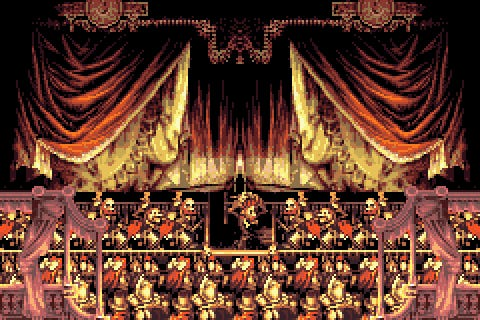
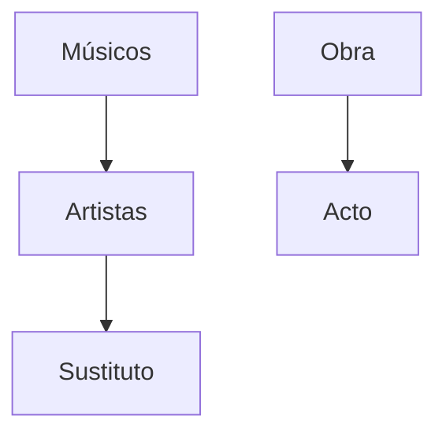

*Warnings*

Para la realización de esta actividad voy a tener los siguientes supuestos:
+ Eres capaz de leer y entender oraciones **largas** y eres capaz de comprender **lo que hay que hacer**.
+ Eres capaz de manejar rutas relativas y absolutas con precisión y te tomas en serio la actividad. Si no realizas las rutas correctamente, no voy a hacer mi trabajo *(tendrás un 0 en el apartado)*
+ Cada actividad va a ser corregida de forma *individual* y separada del resto de actividades.
+ Soy consciente de que estamos tratando retos que no hemos trabajado en profundidad en clase, por ello mismo no tengáis miedo en hacer preguntas.
+ Cuando hagáis comandos, recomiendo encarecidamente apuntarlos puesto que serán relevantes más adelante.
+ Si alguien realiza algún tipo de *brujeria* o *plagio* lo sabré.

*Waymarks*
+ Puesto que esta parte es el setup es un poco más corta de lo habitual, dedicadle tiempo a preparar bien el entorno y a conseguir la integración con VSCode bien.

Opera en Jidoor II
==============================

[Recomendación musical](https://www.youtube.com/watch?v=yYzq0am3B4I)

# Aria di Mezzo Carattere

The Impresario considera que es muy peligroso que María continue actuando, asi que ha decidido cambiar a María por un miembro del público: Celes Chere. Pero el problema principal está claro, Celes no ha podido preparar nada ni ensayar la obra. 

## Tarea 1

Crea una clase de Apex en Visual Studio Code, con el nombre Act que permita recuperar la información de cada uno de los actos, concretamente:

+ El nombre del acto 
+ La id del acto 
+ El nombre del artista que actúa.
+ Las instrucciones del actor
+ La partitura del actor
+ La hora de comienzo
+ La hora de cierre
+ La letra del acto para el actor

*Nota:* De momento vamos a suponer que tenemos toda la información en una misma tabla.

## Tarea 2

Crea una nueva relación de búsqueda que permita buscar actores en la clase Act que acabas de crear

## Tarea 3

Crea una nueva relación de Master-Detail entre los siguientes campos.

Sustituto debe representar que Artista está sustituyendo.

### Reto:
Intenta que cuando realices una búsqueda, si buscas algún sustituto, te muestre todos los resultado del actor que sustituye

# Cierre del acto

Celes ha podido actuar sin problema pero, en el descanso, a medida que el 3er acto se acerca Impresario se ha dado cuenta que han desaparecido todos los Músicos y todas las partituras.

## Tarea 4

Borra los objetos Músicos y Obra. ¿Que ha ocurrido?