*Warnings*
---

Para la realización de esta práctica voy a tener los siguientes supuestos:
+ Conocemos los comandos de git básicos.
+ Tenemos un conocimiento básico de HTML.
+ Tenemos un conocimiento intermedio de Python.
+ Sabemos leer, interpretar y comprender documentación.
+ Podemos leer oraciones **largas** y comprender aquello que se nos solicita.
+ Nos tomamos en serio lo que estamos haciendo, si no trabajáis, yo tampoco lo haré *(y tendréis un 0 en consecuencia)*.
+ Todos los apartados se evalúan de forma *aislada* en la medida de lo posible.
+ Soy consciente que propongo retos que no deberíais de saber *a priori*, por ello estoy disponible en clase para lo que necesitéis.
+ Estos documentos buscan ayudar a completar las distintas tareas, a estudiar, a comprender y profundizar en los contenidos vistos en clase, bajo ningún concepto están pensados para ser un copia y pega de las tareas propuestas o que puedan sustituir a la realización de las prácticas en clase.
+ Si alguien decide *copiar* o hacer *brujería* lo sabré. 

*Waymarks*
---
<center>

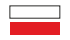

</center>

Para la realización de la práctica es necesario realizar los siguientes puntos previos:
+ Completar la instalación de Git en el equipo. [Descarga de Git](https://git-scm.com/downloads/win)
+ Tener una versión de Python instalada. *(Recomendable la versión 3.13, aunque se va a realizar el ejercicio con la versión 3.11.9)* [Descarga de Python](https://www.python.org/downloads/)
+ Completar la instalación de PostgreSQL. *(Recomendable la version 17.1)* [Descarga de PostgreSQL](https://www.enterprisedb.com/downloads/postgres-postgresql-downloads)
+ Leer Style Guide for Python Code *(PEP 8)* pues haremos referencia a ello en la nomenclatura de variables. [Enlace a PEP 8](https://peps.python.org/pep-0008/)
+ Haber completado la Instalación de Odoo con "Práctica 2: Instalación Odoo desde código fuente" de "La tienda de nº 163" y conocer los distintos módulos que nos ofrece Odoo.

Como IDE es recomendable el uso de PyCharm, aunque personalmente prefiero usar VSCode por comodidad. Lo dejo a preferencia personal.

En el caso de no tener un conocimiento intermedio de Python, durante esta guía se proporcionarán medios para entender las estructuras de datos que estamos empleando y se recomienda encarecidamente intentar comprender su uso y preguntar dudas en clase sobre conceptos que no se entiendan.

Se puede hacer la práctica en Docker exactamente igual, pero la vamos ha realizar de esta forma para comprender por qué se sigue esta estructura.

# Recomendación musical

[OST para el contexto](https://www.youtube.com/watch?v=Ll-G9kiuRwM&list=PL08A3B2B9E728BF6F)

# La tienda de nº 163

Justo cuando termina de configurar el sistema suena la campana de su puerta. 

Nº 163 puede ver como un humano alto se acerca hacia él y le pregunta por "lo de siempre". Sus ojos amarillos se iluminan de alegría, ha llegado su momento. Pero justo entonces ve que no ha conseguido introducir *el objeto* y no sabe donde está. Mientras entra en pánico, busca formas de ganar tiempo, asi que le muestra el inventario.

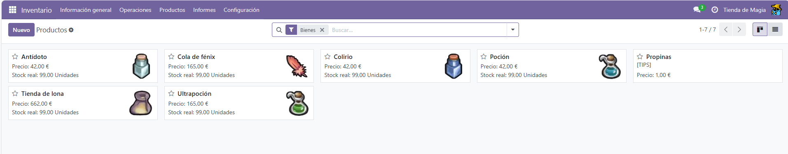

Puede ver la alegría en los ojos del humano, pero de repente le pregunta:

 >¿Cuanto cura una poción? ¿Y que hace el colirio?

A Nº 163 se queda la mente el blanco. Mientras se quedan en silencio se puede ver al humano visiblemente molesto, asi que Nº 163 corre a la trastienda para configurar rápidamente el sistema antes de perder a su primer cliente.

# Parte I: Estructura de un módulo.

En su libro puede leer lo siguiente;

 >Un módulo de Odoo **puede** contener los siguientes elementos 
>
>**Objetos de negocio** o business objects, clases de python que se encargan de definir la estructura de la base de datos por medio de un ORM, o Mapeo Relacional de Objetos. Puedes leer más en los capítulos [Object-Relational Mapping](https://www.fullstackpython.com/object-relational-mappers-orms.html) y [API de ORM en Odoo](https://www.odoo.com/documentation/18.0/es/developer/reference/backend/orm.html#reference-orm).
>
>**Vistas de objetos** que definen como van a ser mostrados los datos al usuario final. Puedes leer más en el capítulo [Views en Odoo](https://www.odoo.com/documentation/18.0/es/developer/reference/backend/views.html#reference-views).
>
>**Archivos de datos**, archivos XML o CSV que definen vistas, informes, parámetros de configuración, datos de muestra, etc.. Para más información, lee el capítulo [Data Files](https://www.odoo.com/documentation/18.0/es/developer/reference/backend/data.html#reference-data).
>
>**Controladores Web** para manejar peticiones de navegadores. Para más información, lee el capítulo [Web Controllers](https://www.odoo.com/documentation/18.0/es/developer/reference/backend/http.html#reference-controllers)
>
>Un módulo es declarado en el archivo manifest y está estructurado de la siguiente manera:
 >
>````
>module
>├── models
>│   ├── *.py
>│   └── __init__.py
>├── data
>│   └── *.xml
>├── __init__.py
>└── __manifest__.py
>````
> Documentación de Odoo: [Server framework 101](https://www.odoo.com/documentation/18.0/developer/tutorials/server_framework_101/01_architecture.html#odoo-modules)


Con las fuerzas renovadas, Nº 163 plantea un módulo que le permita gestionar una tienda con objetos mágicos.

# Definición del módulo

Con el fin de gestionar su tienda, Nº 163 necesitará un módulo que le permita gestionar su inventario y dar información precisa a sus clientes. Actualmente ha podido registrar todos los objetos, pero no es capaz de introducir una serie de valores importantes como si se puede usar durante una batalla o a que categoría pertenece el objeto. 

El modulo también deberá gestionar la compra y venta de productos por parte de aventureros. Hay otros módulos que pueden hacer esto mismo, pero asi nº 163 se quedará mucho mas tranquilo.

# Parte II: Creación del módulo

El primer paso para crear un módulo será activar el Modo de Desarrollador.
Se puede encontrar un botón para activarlo en la parte inferior del apartado Ajustes, por ahora no usaremos ninguna opción adicional asi que haremos clic en `Activar modo de desarrollador`.

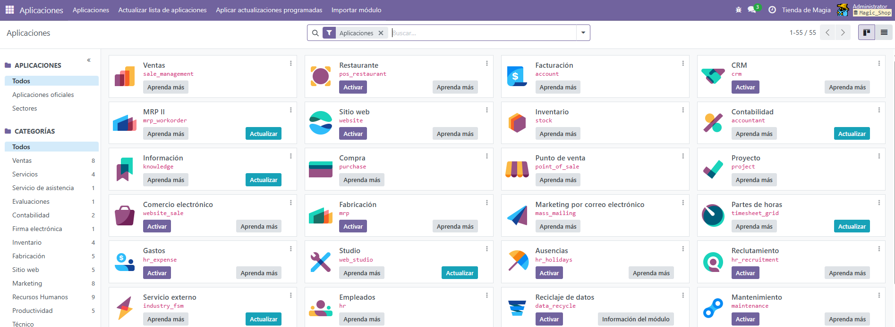

Con el Modo Desarrollador activado podemos apreciar 2 elementos característicos:
1. Bajo el usuario nos indica que BBDD estamos utilizando.
2. Bajo el nombre de cada módulo podremos ver un **identificador**.

Comenzaremos el proceso de creación del módulo creación de una carpeta en el directorio `extra-addons` que definimos en la última práctica. El nombre de este directorio va a ser el **identificador** del módulo que vayamos a diseñar. En nuestro caso va a ser llamado `n_magicshop`.

En el interior de este directorio comenzaremos a dar forma al módulo creando los ficheros `__init__.py` y `__manifest__.py`.

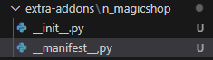

*Ignorad que he puesto una coma en lugar de punto en el manifest, he tardado un rato largo en darme cuenta. Lo dejo tal cual para avisar que no va a dar ningún error si tenéis cualquier aviso en el caso de que escribáis mal el nombre.*

## El fichero \_\_manifest\_\_.py

El fichero `__manifest__.py` va a contener la declaración del módulo como hemos mencionado previamente. Asi que en su interior vamos a crear un diccionario en Python, indicando el nombre del módulo de la siguiente forma.

````Python
{
    "name": "Magic Shop Management System",
}
````
**Información útil:**

+ [Más sobre Diccionarios en Python](https://docs.python.org/3/tutorial/datastructures.html#dictionaries)

+ [Campos en el fichero \_\_manifest\_\_](https://www.odoo.com/documentation/saas-13/reference/module.html#:~:text=Edit%20on%20GitHub-,Manifest,each%20key%20specifies%20module%20metadatum.&text=classification%20category%20within%20Odoo%2C%20rough%20business%20domain%20for%20the%20module.)

Cabe destacar que el fichero ha de contener unicamente el campo name para que funcione

Una vez hemos definido todos estos ficheros podremos reiniciar el servicio y ver nuestro módulo recién creado en Odoo.

Para que nos salga en la lista de módulos actualizado habrá que completar los siguientes pasos:

1. **Reiniciar** el servicio. Es un rollo, pero por esto hemos dedicado tanto tiempo a configurar el arranque del sistema.
2. Clicar en el botón **Actualizar lista de aplicaciones** del banner superior de Aplicaciones. Esto nos permitirá conseguir la última versión de las aplicaciones que hayamos modificado.

Una vez hayamos completado los pasos, si realizamos una búsqueda en el apartado de aplicaciones podremos ver que ya aparece nuestro módulo.

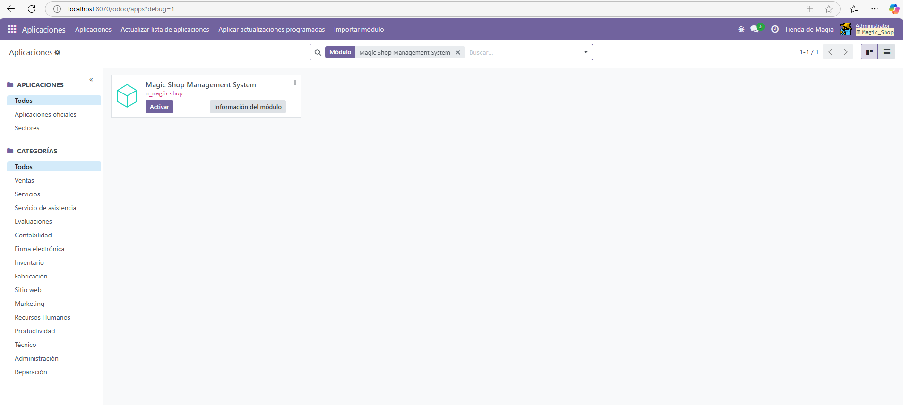

Ahora podremos activar el módulo y cambiar el contenido de su interior como nos plazca modificando el fichero `__manifest__.py`. 

````Python
{
    'name' : "Magic Shop Management System",
    'author' : "Nº 163",
    'license' : "LGPL-3",
    'version' : "1.0",
    'description' : """
        This module manages nº 163 shop
    """,
    'category' : "Inventory",
}
````
En mi caso voy a modificar cada uno de los campos, aunque vosotros podréis modificarlo a placer.

Para las categorías, se recomienda escoger una dentro de todas las [disponibles](https://github.com/odoo/odoo/blob/18.0/odoo/addons/base/data/ir_module_category_data.xml)

# Parte III: Creación de Modelos

Una vez creado el archivo ya podemos comenzar con los datos que vamos a utilizar en este módulo.

Primero vamos a crear un directorio en la carpeta de nuestro addon llamada `models` y en su interior crearemos 2 ficheros un `__init__.py` y un `magicitem.py`. 

Una vez hayamos creado la estructura, se deberá definir que hemos creado esta carpeta, asi que modificaremos los ficheros `__init__.py` de la siguiente forma.`

En el fichero dentro de `n_magicshop` importaremos la carpeta que acabamos de crear.

````python
from . import models 
````

En el fichero dentro de `models` importaremos el archivo magicitem.py con el siguiente comando.

````python
from . import magicitem
````
### Imports en Python

La estructura del import es la siguiente: 
```python
from DE_DONDE_QUEREMOS_IMPORTAR import QUE_QUEREMOS_IMPORTAR as COMO_LLAMAMOS_A_LO_QUE_QUEREMOS_IMPORTAR
````

De tal forma la siguiente instrucción nos permite importar la librería mathplotlib y usarla dentro de nuestro de código con el nombre plt.

```python 
import mathplotlib as plt
```

## Estructura del modelo

Una vez hemos hecho los imports pertinentes vamos a crear el objeto principal de nuestro modulo. Como hemos mencionado previamente había que definir un sistema para la gestión de la tienda asi que vamos a crear una estructura que nos permita almacenar objetos.

Todos los objetos cumplen con las siguiente condiciones.

+ Todo objeto tiene un nombre.
+ Todo objeto tiene un valor definido. Se podrán vender en la tienda por este valor y los podremos comprar por la mitad de precio.
+ Todo objeto tiene una clasificación indicando el tipo de objeto que puede ser de 4 tipos: Restauración, Ofensivo, Gema o Clave.
+ Todo objeto podrá ser Equipable o no.
+ Todo objeto tiene unas especificaciones concretas.

Luego tendremos que especificar más elementos en la estructura del modelo pero con todo esto nos vale.

En el fichero `magicitem.py` añadiremos el siguiente código.

```` Python
from odoo import models, api, fields


class MagicShopMagicItem(models.Model):
    _name = 'magicshop.magicitem'
````

Con este código estamos consiguiendo los siguientes puntos.

1. Importamos los ficheros `models.py`, `api.py` y `fields.py` de la carpeta `odoo` en `magicitem` los cuales son necesarios para la creación del modelo.

2. Creamos la clase MagicShopMagicItem usando [Pascal Case](https://www.odoo.com/documentation/18.0/contributing/development/coding_guidelines.html#symbols-and-conventions) y extenderá de `Model`.

3. Definimos los atributos de la clase, de los cuales `_name` es el que tiene más importancia. Por lo general se suele emplear `MODELO.NOMBRE`.

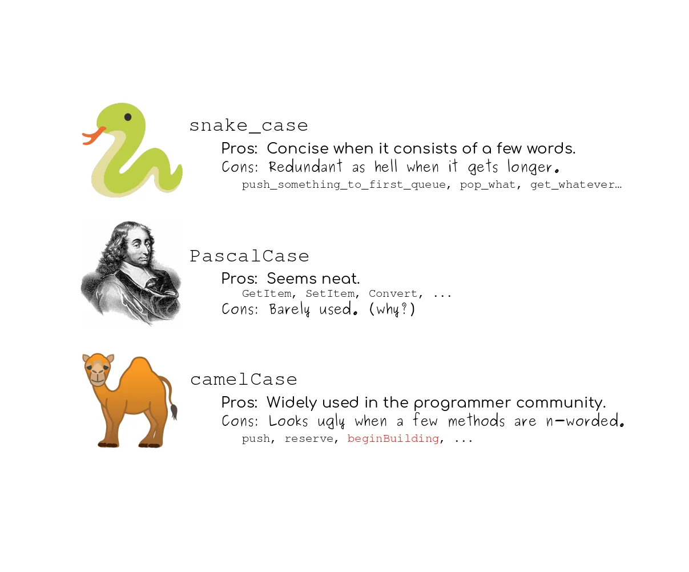

Luego habría que definir el resto de parámetros asi que seguiremos la siguiente tabla hecha en base a las especificaciones previas.

<center>

|Campo|Tipo|
|:-|:-|
|Nombre| `Char`|
|Categoría|`Selector`|
|Valor|`Integer`|
|Equipable|`Boolean`|
|Descripción|`Text`|

</center>

Donde `Categoría` deberá tener como valores posibles 'Restauración', 'Ofensivo', 'Gema' o 'Clave'.

Es importante definir que cuando definimos un selector, cada uno de los valores tiene la siguiente estructura `(valor, etiqueta)`

Luego a cada uno de estos campos le podemos pasar atributos de configuración como parámetros adicionales de la siguiente forma.

```` Python
nombre = fields.Char(required=True)
````

Otros atributos de configuración:

|Atributo|Tipo|Valor por defecto|Descripción|
|:-|:-:|:-:|:-|
|string|`str`| El nombre del campo| Es el nombre del campo en la UI. Es visible para los usuarios.|
|required|`bool`|`False`|Si el valor es `True` el campo no podrá estar vacío, deberá tener un valor por defecto o asignarle un valor cuando se crea el registro.
|index|`bool`|`False`| Le pide a Odoo que cree un índice para esa columna.|
|help| `str`|`''`|Muestra una descripción para los usuarios en la UI|

De tal forma que nuestro modelo quedaría de la siguiente forma

<center>

|Campo|Tipo|Atributo|
|:-|:-|:-|
|Nombre| `Char`|Required|
|Categoría|`Selection`|
|Valor|`Integer`| Required|
|Equipable|`Boolean`|
|Descripción|`Text`|Required|

</center>

Por ultimo hay que destacar que Odoo crea una serie de campos adicionales de forma automática. Dichos campos son los siguientes:

<center>

|Atributo|Tipo|Descripción|
|:-|:-:|:-|
|id|`Id`| Identificador único del registro|
|create_date|`Datetime`|Fecha de creación del registro|
|create_uid|`Many2one`|Usuario que creó el registro|
|write_date| `Datetime`|Última modificación del registro|
|write_uid| `Many2one`|Usuario que realizó la última modificación|

</center>

Por supuesto, se puede desactivar la creación de estos campos deshabilitando `_log_access` aunque esto no lo vamos a tratar.  

## Código del Modelo

Tras hacer unos cuantos cambios a la estructura de `magicitem.py`, donde hemos creado un campo adicional que se encarga de dar una descripción detallada del objeto, quedaría de la siguiente forma:

```` Python
from odoo import models, api, fields


class MagicShopMagicItem(models.Model):
    _name = 'magicshop.magicitem'
    _description = 'Magic Item Master'

    item_name = fields.Char(string = "Item name", required = True)
    item_category = fields.Selection(
        [
            ('recovery', 'Recovery'),
            ('jewels', 'Jewels'),
            ('offensive', 'Offensive'),
            ('key', 'Key'),
        ],
    )
    detailed_item_description = fields.Text(required = True)
    shown_item_description = fields.Text(required = True)
    sell_value = fields.Char(required = True)
    can_be_equipped = fields.Boolean()
````

Ahora deberemos actualizar nuestro módulo y nos iremos al apartado `Modelos` dentro del desplegable `Técnico` en la pestaña `Ajustes` y si lo hemos hecho todo bien debería aparecer nuestro nuevo Modelo.

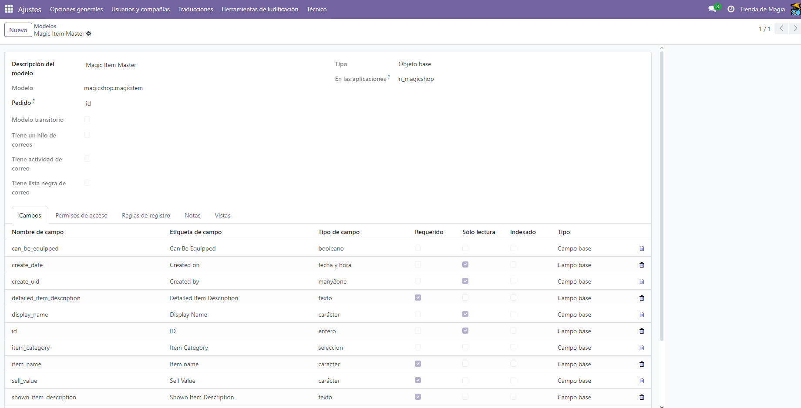

Me gustaría destacar como Odoo modifica los nombres de la `Etiqueta de Campo` para que "_" sea un espacio y que la siguiente palabra comience por mayúscula frente a `item_name` que tiene un campo personalizado gracias a nuestro atributo `string`. 

De hecho, si buscamos en nuestro pgadmin, podremos ver como se ha creado ya la tabla en la base de datos con los campos que hemos definido.

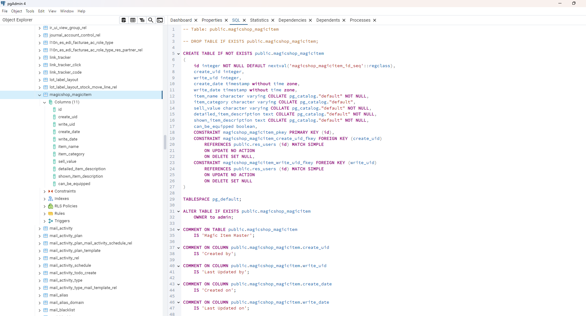

### FAQ:

**¿Cómo actualizo mi módulo?**

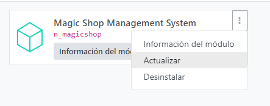

**¿Cómo accedo a mi modelo?**

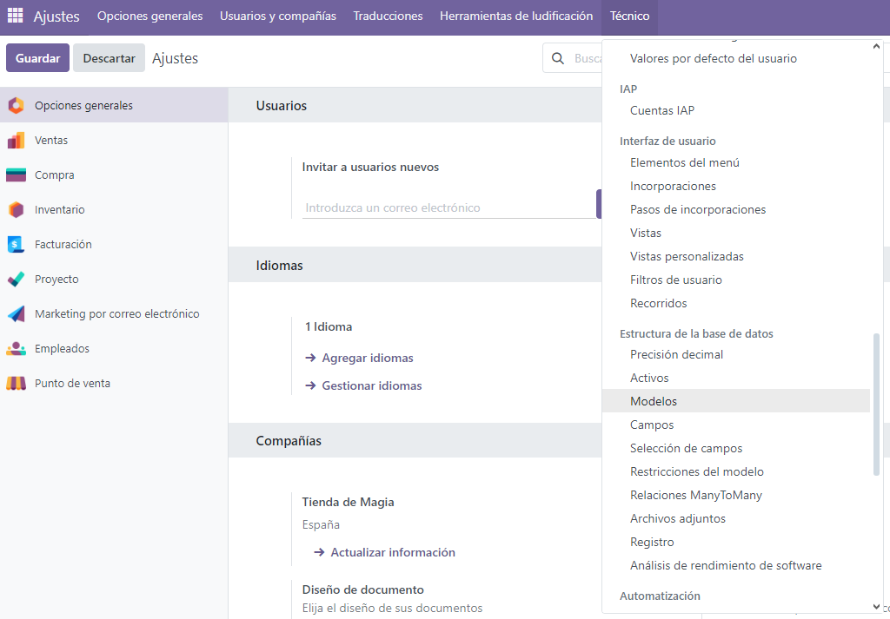

# Parte IV: Creación de vistas

El siguiente paso es permitir al usuario acceder a la nueva estructura que hemos diseñado y eso lo vamos a poder conseguir por medio de la creación de vistas *(aunque siendo completamente justos Odoo nos proporciona una vista generada por defecto, pero esta vista no es aceptable **bajo ningún concepto** en una aplicación de un negocio)*.


***Waymarks*:** 
---

<center>

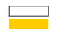

</center>

+ Gran parte de la información a la que haremos referencia en este punto se encuentra [aquí](https://www.odoo.com/documentation/18.0/developer/reference/user_interface/view_architectures.html#view-architectures). Recomiendo encarecidamente leer y comprender los distintos atributos y componentes.

+ Actualmente hay un módulo y un modelo creados siendo `n_magicshop` y `magicshop.magicitem`, podemos acceder a ellos y podemos modificarlos libremente. 

+ El sistema funciona sin errores.

## Creación de la vista

Para poder crear la vista vamos a crear un nuevo directorio llamado `views` en `n_magicshop` donde guardaremos los ficheros `.xml` de las vistas que definamos.

Crearemos 2 nuevos ficheros en el directorio recién creado: `menu.xml` y `magic_item.xml` y, como os habréis imaginado ya, tendremos que indicar al módulo donde se encuentran estos ficheros *(si no se os ha ocurrido, algún dia ocurrirá)*. Para ello tendremos que modificar ``__manifest__.py`` creando un nuevo elemento llamado `data`, donde le indicaremos la ruta a los xml. 

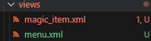

Tras los cambios quedaría asi: 

```` Python
{
    'name' : "Magic Shop Management System",
    'author' : "Nº 163",
    'license' : "LGPL-3",
    'version' : "1.0",
    'description' : """
        This module manages nº 163 shop
    """,
    'category' : "Inventory",
    'data': [
        "views/menu.xml",
        "views/magic_item.xml",
    ],
}
````

Luego en cada uno de los .xml tendremos que definir una estructura base, para luego definir objetos del tipo `menuitem` en su interior. Como ejemplo tenemos el fichero `menu.xml`:

````xml
<?xml version='1.0' encoding='utf-8'?>
<odoo>

    <menuitem id="menu_magic_shop_root" 
            name="nº 163 Magic Shop"/>
            
</odoo>
````
Dentro de una etiqueta `odoo` tenemos una etiqueta del tipo `menuitem` en la que se define un `id` y un `nombre`.

Una vez actualicemos podremos ver como se encuentra dentro del apartado Técnico > Interfaz del Usuario > Elementos del menú.

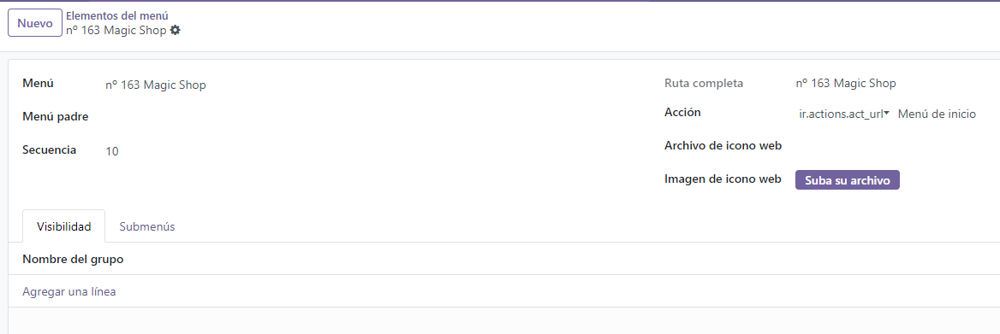

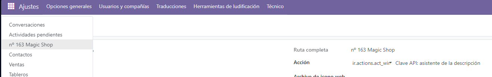

Pero por supuesto todavía tendremos que definir varios puntos.

1. De momento, esta pestaña está descolgada, aparecerá en el menu desplegable si se le asigna una acción concreta. En este caso, al hacer clic en la opción del menu desplegable hará lo que indiquemos en esta pestaña

2. Actualmente es un menu raíz, querremos crear varios submenus como es el caso del módulo ventas por ejemplo.

Con el fin de comprender todos estos puntos, haremos una modificación al fichero `menu.xml`

````xml
<?xml version='1.0' encoding='utf-8'?>
<odoo>

    <menuitem id="menu_magic_shop_root" 
            name="nº 163 Magic Shop"/>
  
    <menuitem id="menu_magic_shop_magic_items" 
            name="Magic Items"/>   

</odoo>
````

Tras esto podremos observar como aparecen ambos menús pero no tienen ningún tipo de relación entre ellos. 

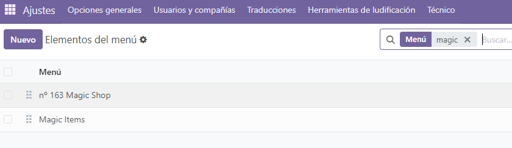

Luego como podréis observar en las imágenes anteriores en el menú recién creado se puede apreciar un campo llamado Menú Padre. Para modificarlo podemos hacerlo desde la interfaz aunque es recomendable por medio de una instrucción en el xml: `parent="menu_magic_shop_root"` donde estableceremos cual es el directorio padre utilizando el id.

De esta forma esta seria la relación resultante.

<center>

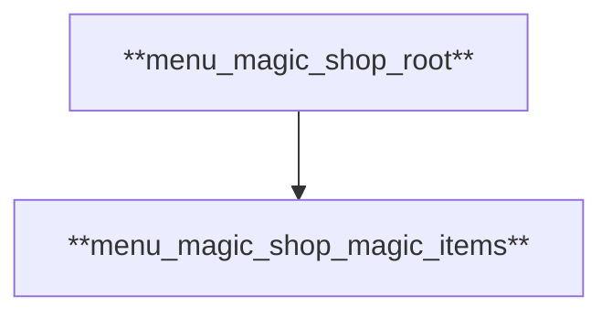

</center>

Y aparecerá de la siguiente forma.

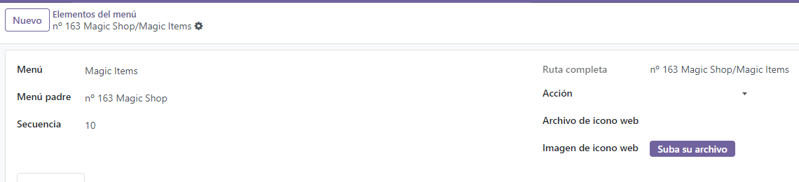

Pero, *spoiler*, esto nos supondrá un pequeño fallo más adelante. La forma en la que se ejecuta nuestro manifest es secuencial, por lo que se ejecutará primero el xml padre y luego el hijo. Hay que tener especial cuidado en que esto **NO** sea así. Primero se han de ejecutar todos los elementos que no tienen dependencias y por último aquellos que si dependen de otros. Siguiendo el gráfico anterior, de abajo a arriba. 

De forma que el manifest quedaría así.

```` Python
{
    'name' : "Magic Shop Management System",
    'author' : "Nº 163",
    'license' : "LGPL-3",
    'version' : "1.0",
    'description' : """
        This module manages nº 163 shop
    """,
    'category' : "Inventory",
    'data': [
        "views/magic_item.xml",
        "views/menu.xml",
    ],
}
````

Ahora ya que hemos definido la estructura de nuestro módulo habrá que definir la acción para poder acceder a todo lo que acabamos de hacer.  

*Aviso a caminantes*
---
Sé que parece muy fácil este punto hasta ahora, pero si queréis innovar y hacer algo vuestro es seguramente el punto más complicado de toda la práctica. Prestad especial atención a como definís las etiquetas y, si ocurre algún problema, leed bien los logs porque dan mucha información sobre que error tenéis que hacer frente. 

Os dejo [aqui](https://www.cybrosys.com/blog/how-to-fix-the-common-errors-in-odoo-16) un blog sobre los posibles errores y como enfrentarse a ellos. *(In english as always :wink:)*

## Acciones en Odoo

Bueno, retomando la práctica, como hemos mencionado previamente, para que aparezca en el desplegable es necesario definir una acción concreta. Se podría hacer desde la interfaz en el apartado de acciones, pero no tendría ningún tipo de gracia, asi que vamos a definir la acción por código.

Entraremos a `menu.xml` y lo primero que vamos a hacer es definir en `Magic Items` una acción, en mi caso la he llamado `action_magic_shop_magic_item`. Luego tendríamos que definir el fichero `magic_item.xml` para que defina la acción, por lo que queda de la siguiente forma:

```` xml
<?xml version='1.0' encoding='utf-8'?>
<odoo>
    <record id="action_magic_shop_magic_item" model="ir.actions.act_window">
        <field name="name">Magic Item</field>
        <field name="res_model">magicshop.magicitem</field>
        <field name="view_mode">tree,form</field>
        <field name="help" type="html">
            <p class="o_view_nocontent_smiling_face">
                Create a new magic item.
            </p>
        </field>
    </record>
</odoo>
````

Y este sería el resultado.

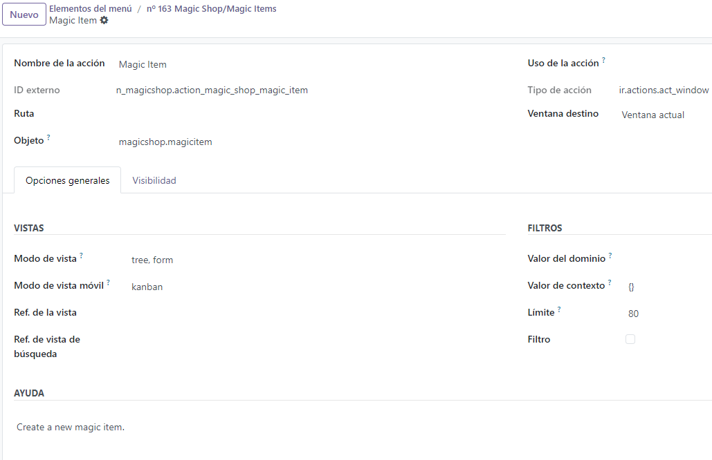

Veremos más sobre vistas y acciones más adelante, pero por ahora hace el apaño.

# Parte V: Logs, Warnings y Seguridad.

Perfecto, ya hemos creado nuestras dos vistas, ya hemos definido las acciones y podemos utilizarlas, si no fuera por el inconveniente de que no aparecen en el desplegable. Podemos fingir que sabemos solucionarlo activando el superusuario desde el modo debug e ignorando el problema, pero si nos fijamos en el Log del programa veremos lo siguiente:

````
2024-12-02 20:26:19,970 27468 WARNING Magic_Shop odoo.modules.loading: The models ['magicshop.magicitem'] have no access rules in module n_magicshop, consider adding some, like:

id,name,model_id:id,group_id:id,perm_read,perm_write,perm_create,perm_unlink
n_magicshop.access_magicshop_magicitem,access_magicshop_magicitem,n_magicshop.model_magicshop_magicitem,base.group_user,1,0,0,0
````

El programa nos avisa de que nuestro modelo no tiene reglas de acceso a nuestro módulo. Siguiendo el tutorial proporcionado por Odoo nos habríamos enfrentado previamente a esto, pero asi lo vivimos todo de una forma mucho más orgánica. Si queremos solucionarlo Odoo es tan generoso que nos proporciona una alternativa, asi que le haremos caso.

Crearemos un directorio nuevo llamado `security` dentro de nuestro módulo y en su interior crearemos un fichero `ir.model.access.csv`, este nombre es importante porque estaremos creando datos en la tabla del acceso a modelos.

En este fichero guardaremos un csv con los datos establecidos en el warning. Como quizá resulta difícil de leer, voy a modificar el formato para apreciarlo mejor

<center>

|campo|valor|
|-|-|
`id`|n_magicshop.access_magicshop_magicitem
`name`|access_magicshop_magicitem
`model_id:id`|n_magicshop.model_magicshop_magicitem
`group_id:id`|base.group_user
`perm_read`|1
`perm_write`|0
`perm_create`|0
`perm_unlink`|0

</center>

Todos los nombres son bastante explicativos, y todos los valores se han cogido directamente del warning pero quiero establecer un par de puntos.
+ `Id` y `name` da igual el valor que le demos.
+ `Model_id` deberá comenzar por model_
+ Intentemos que `Group_id` tenga este formato *(no he hecho demasiadas pruebas todavía)*
+ Permiso de lectura es importante que esté a 1, el resto como queráis

**Súper importante:** Hay que importar este fichero en la primera posición del campo data en el fichero `__manifest__.py`.

Y ya con el fichero creado veremos como hemos conseguido crear un permiso de acceso para nuestro modelo, que ya no aparece el warning en el log y como aparece en nuestro menú desplegable.

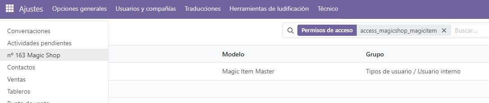

***Waymarks*:** 
---

<center>

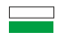

</center>

Ahora, con todo el sistema creado hasta aquí, la estructura de nuestro modulo se habrá quedado similar a esta:

<center>

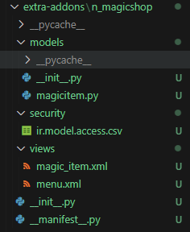

</center>

También habremos definido un módulo, un modelo y será accesible desde el menú desplegable.

# Parte VI: Cierre

Solo nos quedaría una única pregunta por ahora. ¿Cómo puedo hacer para posicionar el módulo dentro del desplegable?

Bueno, si nos fijamos en el resto de modelos podemos ver como tienen asignado un valor `Secuencia` a más alto el valor, más bajos van a estar dentro del desplegable. Por ejemplo, si buscamos `Ajustes` tendrá un valor de secuencia igual a `550` mientras que `Ventas` tendrá `30` asignado. Si queremos modificar la posición dentro del desplegable, será suficiente con añadir la línea `sequence=VALOR` al `menuitem` padre.

Tras todo esto, podremos entrar a nuestro módulo y, tras solucionar un pequeño error que os voy a dejar a vosotros, quedaría tal que asi. No es bonito, pero es nuestro.

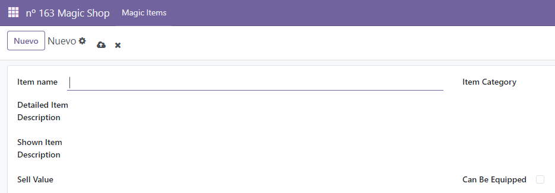


Y si queremos almacenar un dato podremos ver como se guarda dentro de nuestra base de datos. Podemos usar una herramienta como dbeaver para ver que efectivamente se ha almacenado el campo en la base de datos.


id|create_uid|write_uid|create_date            |write_date             |item_name   |item_category|sell_value|detailed_item_description                                                                                            |shown_item_description|can_be_equipped|
--|----------|---------|-----------------------|-----------------------|------------|-------------|----------|---------------------------------------------------------------------------------------------------------------------|----------------------|---------------|
 1|         2|        2|2024-12-02 21:58:14.210|2024-12-02 21:58:14.210|Phoenix Down|recovery     |150       |Revives a single character from KO. HP drops to 1-10 if target is undead. Has no effect if target is a zombie and KO.|Cures KO.             |false          |

 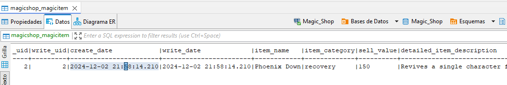

 Y con esto concluye la parte 2 de creación de módulos. En la siguiente parte enseñaremos a nº 163 a crear vistas.