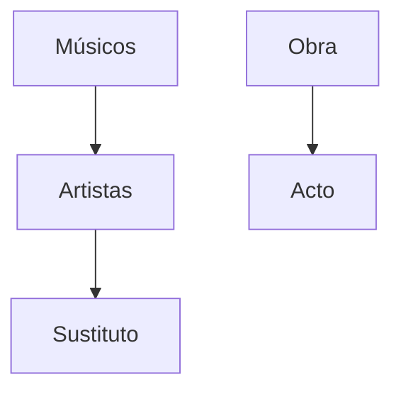

*Warnings*

Para la realización de esta actividad voy a tener los siguientes supuestos:
+ Eres capaz de leer y entender oraciones **largas** y eres capaz de comprender **lo que hay que hacer**.
+ Eres capaz de manejar rutas relativas y absolutas con precisión y te tomas en serio la actividad. Si no realizas las rutas correctamente, no voy a hacer mi trabajo *(tendrás un 0 en el apartado)*
+ Cada actividad va a ser corregida de forma *individual* y separada del resto de actividades.
+ Soy consciente de que estamos tratando retos que no hemos trabajado en profundidad en clase, por ello mismo no tengáis miedo en hacer preguntas.
+ Cuando hagáis comandos, recomiendo encarecidamente apuntarlos puesto que serán relevantes más adelante.
+ Si alguien realiza algún tipo de *brujería* o *plagio* lo sabré.

Opera en Jidoor III
==============================

[Recomendación musical](https://www.youtube.com/watch?v=yYzq0am3B4I)

# Wedding Waltz ~ Duel

Locke Cole, el compañero de Celes, está preocupado por la obra asi que procede a intentar encontrar a todos los artistas que participan en la obra. Como el tiempo apremia, debe ser rápido con su búsqueda.

## Tarea 1

Crea 5 objetos personalizados y establece las relaciones pertinentes.

## Tarea 2

Crea [**USANDO APEX**](https://trailhead.salesforce.com/es/content/learn/modules/object-oriented-programming-for-admins) los usuarios que tenias antes.

----

Locke ha podido encontrar a tiempo a los usuarios pero Impresario está asustado de que pueda haber alguien en el público que este causando estragos asi que para este descanso ha mandado a todos los espectadores fuera del recinto con la premisa de que preparar una sorpresa para los espectadores. 

## Tarea 3

Crea un nuevo registro en Obra llamado cupo máximo con el valor 150 y crea un [trigger en Apex](https://trailhead.salesforce.com/es-MX/content/learn/modules/apex_triggers/apex_triggers_intro) que compruebe antes de cada inserción o actualización si el número de espectadores excede el cupo establecido para la obra. 

Si se excede este cupo no se permitirá entrar al espectador. 

Comprueba su funcionamiento usando el csv en `src/espectadores_opera.csv`

## Tarea 4

Usa Data Loader para crear una copia de seguridad de todos los artistas y Músicos.

---

Con todo esto Locke ya esta listo para el **Gran Final**.

# Retos

1. Crea un Componente Lightning que muestre todos los Artistas en una tabla.
2. Utiliza Batch Apex para establecer la nacionalidad de todos los espectadores a "Jidoor"